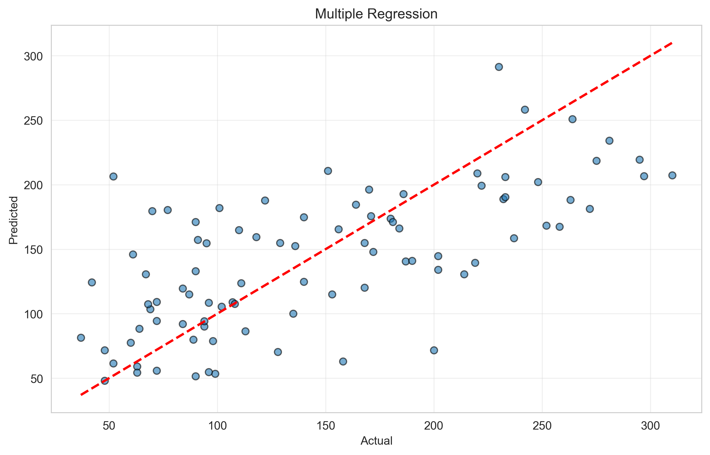
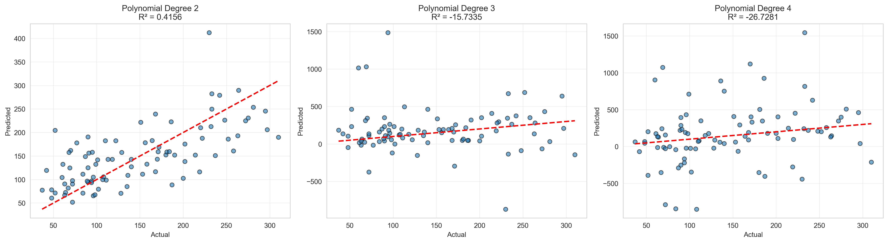
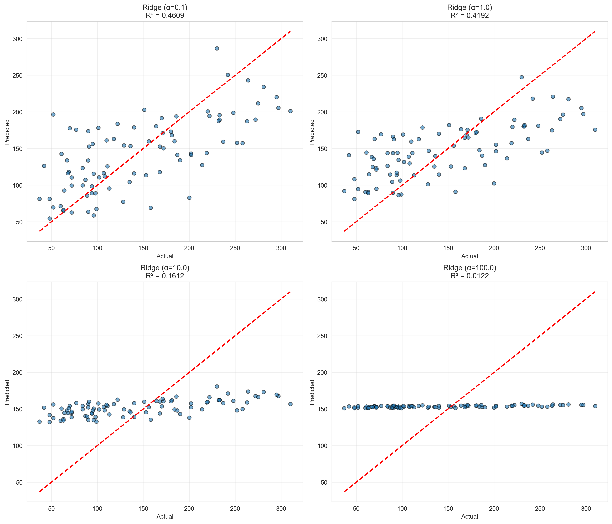
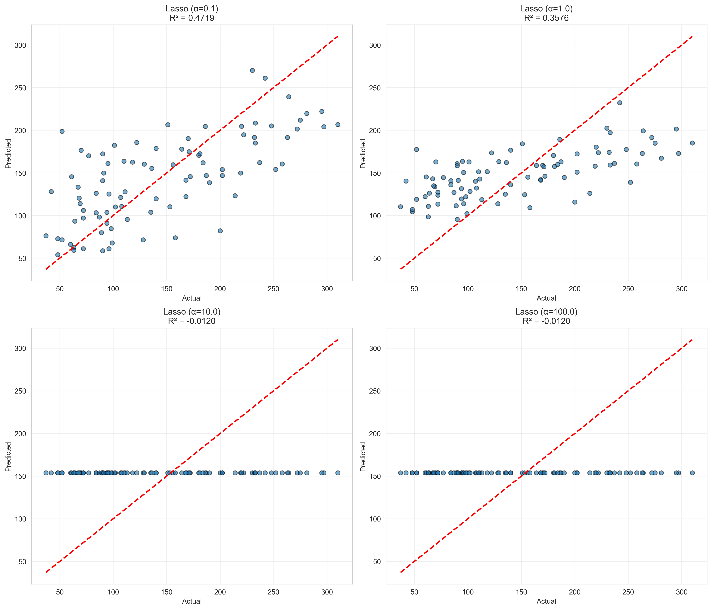
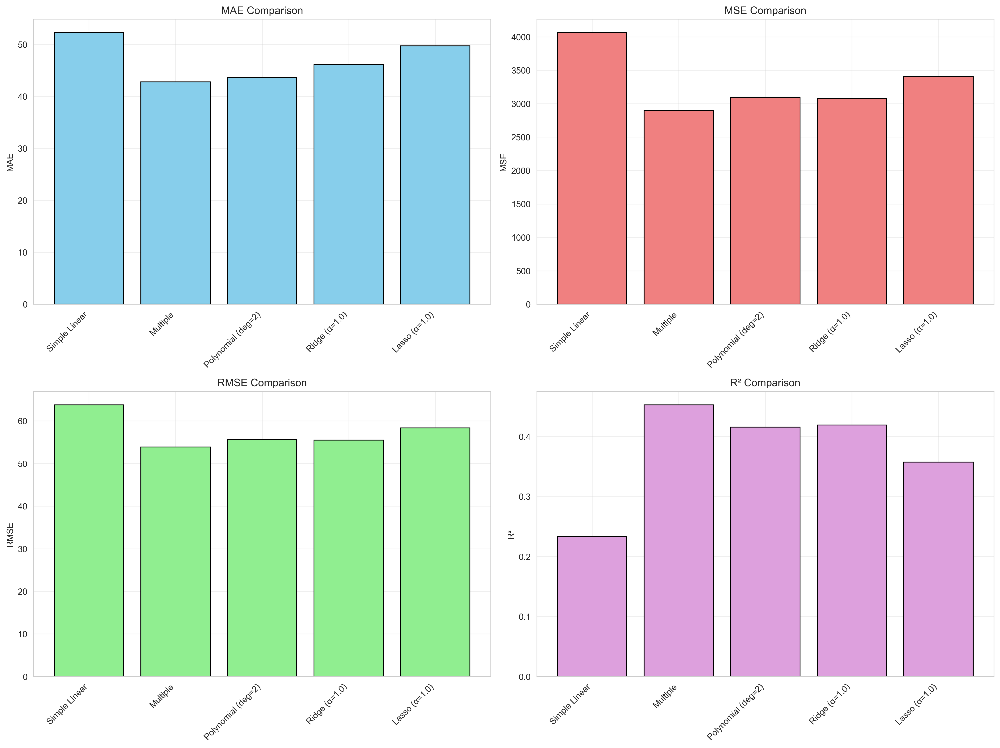

# MSCS_634_Lab_4: Regression Analysis with Regularization

## Overview

This repository contains a comprehensive analysis of multiple regression techniques applied to the Diabetes dataset from scikit-learn. The lab explores how different regression methods perform when predicting disease progression based on various health measurements.

## Purpose

The main objectives of this lab are to:

- Implement and compare various regression models including simple linear regression, multiple regression, and polynomial regression
- Apply regularization techniques (Ridge and Lasso) to understand how they prevent overfitting and improve model generalization
- Evaluate model performance using standard metrics such as MAE, MSE, RMSE, and R²
- Visualize model predictions and understand the relationships between features and disease progression
- Investigate how regularization parameters affect model behavior and performance

## Dataset

The analysis uses the Diabetes dataset from `sklearn.datasets`, which contains:
- 442 samples of diabetes patients
- 10 baseline features: age, sex, body mass index, average blood pressure, and six blood serum measurements
- A quantitative target variable representing disease progression one year after baseline

All features in the dataset are already standardized, making them suitable for direct use in regression models without additional preprocessing.

## Visualizations

The analysis includes comprehensive visualizations to illustrate model performance and behavior:

### 1. Target Distribution

*Distribution and boxplot of the disease progression target variable*

### 2. Simple Linear Regression

*BMI vs Disease Progression with fitted regression line*

### 3. Multiple Regression

*Predicted vs actual values for multiple regression model*

### 4. Polynomial Regression

*Comparison of polynomial regression models with degrees 2, 3, and 4*

### 5. Ridge Regression

*Ridge regression performance across different alpha values*

### 6. Lasso Regression

*Lasso regression performance across different alpha values*

### 7. Model Comparison Metrics

*Comprehensive comparison of MAE, MSE, RMSE, and R² across all models*

### 8. Alpha Impact Analysis

*Effect of regularization parameter alpha on Ridge and Lasso performance*

## Repository Contents

- `regression_analysis.ipynb` 
- `README.md` 
- `screenshots/` 

## Notebook Structure

The Jupyter Notebook is organized into the following sections:

### 1. Import Libraries
Loads all necessary packages for data manipulation, modeling, and visualization.

### 2. Data Preparation and Exploration
The Diabetes dataset contains 442 samples with 10 features representing health measurements for diabetes patients. Features include age, sex, body mass index, average blood pressure, and six blood serum measurements. The target variable represents disease progression one year after baseline. All features are pre-standardized, requiring no additional preprocessing.

### 3. Simple Linear Regression
Uses BMI as a single predictor to establish a baseline model. This demonstrates how a single feature performs and provides context for understanding the improvements gained from more complex models.

### 4. Multiple Regression
Incorporates all 10 features to predict disease progression. This approach captures linear relationships between multiple health measurements and the target variable, significantly improving upon the single-feature model.

### 5. Polynomial Regression
Transforms features into polynomial terms (degrees 2, 3, and 4) to capture non-linear relationships. This section demonstrates how model complexity affects performance and the risk of overfitting as polynomial degree increases.

### 6. Ridge Regression
Applies L2 regularization with different alpha values (0.1, 1.0, 10.0, 100.0). Ridge regression prevents overfitting by penalizing large coefficient values while retaining all features. The alpha parameter controls regularization strength.

### 7. Lasso Regression
Applies L1 regularization with the same alpha values. Unlike Ridge, Lasso can drive coefficients to exactly zero, performing automatic feature selection. This creates simpler, more interpretable models.

### 8. Model Comparison
Compares all models using MAE, MSE, RMSE, and R² metrics. Visualizations show performance differences and help identify which approaches work best for this dataset.

## Key Insights

### Model Performance

The analysis revealed several important patterns:

1. **Simple vs Multiple Features**: Using a single feature (BMI) provided limited predictive power, while incorporating all ten features substantially improved model performance. This demonstrates that disease progression depends on multiple health factors working together.

2. **Polynomial Regression**: Adding polynomial terms allowed models to capture non-linear relationships in the data. However, performance peaked at moderate polynomial degrees (2-3), with higher degrees showing signs of overfitting. This highlighted the classic bias-variance tradeoff in machine learning.

3. **Regularization Effects**: Both Ridge and Lasso regularization helped control model complexity:
   - Ridge regression shrunk all coefficients proportionally, maintaining all features while preventing any single feature from dominating
   - Lasso regression performed automatic feature selection by driving some coefficients to exactly zero, creating simpler, more interpretable models

### Impact of Alpha Parameter

The regularization strength parameter (alpha) significantly influenced model behavior:
- Lower alpha values produced models similar to standard regression with minimal regularization
- Moderate alpha values provided the best balance between fitting the training data and generalizing to new data
- Very high alpha values introduced too much bias, degrading performance by oversimplifying the model

### Choosing Between Ridge and Lasso

The choice between regularization methods depends on the specific scenario:
- **Ridge** works well when most features contribute meaningful information and should be retained
- **Lasso** is preferable when feature selection matters, either for interpretability or when suspecting that some features are irrelevant

For the Diabetes dataset, both methods performed comparably at optimal alpha values, slightly improving upon standard multiple regression by reducing overfitting without sacrificing too much flexibility.

## Challenges and Decisions

### Technical Considerations

1. **Train-Test Split**: A standard 80-20 split was used with a fixed random seed to ensure reproducibility across different model runs and fair comparisons.

2. **Alpha Value Selection**: Testing a range of alpha values (0.1, 1.0, 10.0, 100.0) on a logarithmic scale helped identify how regularization strength affects performance. In practice, techniques like cross-validation would further optimize this selection.

3. **Polynomial Degree Selection**: Experimenting with degrees 2, 3, and 4 revealed how model complexity affects overfitting. Degree 2 or 3 typically provided the best results without excessive complexity.

4. **Visualization Strategy**: Multiple visualization approaches were employed:
   - Scatter plots with regression lines for simple linear regression
   - Predicted vs actual value plots for assessing model fit
   - Bar charts for comparing metrics across models
   - Line plots for understanding how alpha affects regularization

### Interpretation Challenges

One challenge was balancing technical accuracy with clear communication. The goal was to explain complex concepts like regularization and the bias-variance tradeoff in accessible terms while maintaining analytical rigor.

Another consideration was deciding which models to highlight in visualizations. With many alpha values and polynomial degrees tested, selecting representative examples required balancing comprehensiveness with clarity.

## How to Use

### Running the Notebook

1. Clone this repository:
   ```bash
   cd MSCS_634_Lab_4
   ```

2. Install required dependencies:
   ```bash
   pip install numpy pandas matplotlib seaborn scikit-learn jupyter
   ```

3. Launch Jupyter Notebook:
   ```bash
   jupyter notebook regression_analysis.ipynb
   ```

4. Run all cells sequentially 

The notebook automatically saves all visualizations to the `screenshots/` folder.

## Requirements

- Python 3.7+
- NumPy
- Pandas
- Matplotlib
- Seaborn
- scikit-learn
- Jupyter Notebook

